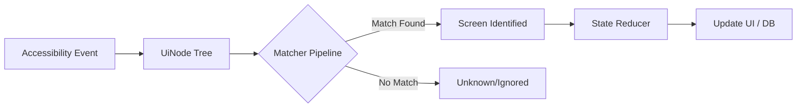

# 🚗 DashBuddy

   

**DashBuddy** is an intelligent companion app for delivery drivers. It utilizes the Android
Accessibility Service API to analyze the driver's screen in real-time, automating logs, tracking
mileage, and providing safety-focused utility overlays.

> **🚧 PROJECT STATUS: EARLY BETA**
>
> This project is currently under active development. Features are being refactored for stability,
> and the detection pipeline is being trained on new screen variations. It is not yet ready for
> general public release.

---

## 🎯 Key Features

* **⏱️ Automated Shift Logging:** Automatically detects when a "Dash" starts and ends, logging
  duration and earnings.
* **📍 Mileage Tracking:** Intelligent odometer reading updates based on app state (only tracks while
  active).
* **🛡️ Dash Protection:** Auto-resume functionality detects when the delivery app pauses the driver
  and offers a one-tap fix.
* **📊 Offer Analysis:** (In Progress) Parses incoming delivery offers to calculate price-per-mile
  and hourly rates instantly.
* **🔒 Privacy-First:** All processing happens **on-device**. Sensitive banking and personal
  information screens are explicitly detected and ignored by the pipeline.

---

## 🛠️ Tech Stack

DashBuddy is built with modern Android engineering practices:

* **Language:** Kotlin
* **UI:** Jetpack Compose (Overlays & Dashboard)
* **Dependency Injection:** Hilt (Dagger)
* **Asynchronicity:** Coroutines & Kotlin Flows
* **Persistence:** Room Database
* **Architecture:** Unidirectional Data Flow (UDF) with a custom Recognition Pipeline.

---

## 🏗️ Architecture: The Recognition Pipeline

DashBuddy solves the problem of "understanding" a third-party app without an API by using a custom *
*Pipeline Architecture**:

1. **Ingestion:** The `AccessibilityService` captures UI events.
2. **Normalization:** The raw Android hierarchy is converted into a lightweight, immutable `UiNode`
   tree.
3. **Recognition:** The tree is passed through a chain of **Screen Matchers** (e.g.,
   `IdleMapMatcher`, `OfferMatcher`).
    * *Note:* Matchers use a weighted priority system to resolve conflicts.
4. **State Machine:** Identified screens trigger a `StateContext`, which feeds into a central
   Reducer to update the `AppState`.
5. **Effects:** State changes trigger side effects, such as updating the database, showing a
   floating bubble, or logging an event.

---

## 🧪 Testing Infrastructure

DashBuddy relies on a robust **Snapshot Regression System** to ensure updates don't break screen
recognition.

* **Inbox Workflow:** We dump raw screen captures (JSON) into an "Inbox" folder.
* **Automated Triage:** A dedicated test processor scans the inbox, detects sensitive data (PII),
  and auto-sorts files into regression suites.
* **Pipeline Tests:** Parameterized tests verify that every known screen type is correctly
  identified by the current set of Matchers.

👉 **[Read the Test Documentation](app/src/test/README.md)** for details on the testing workflow.

---

## 🔒 Privacy & Safety

This app requires **Accessibility Permissions** to function.

* **Zero Data Exfiltration:** Screen data is processed in ephemeral memory and discarded immediately
  after identification.
* **Sensitive Data Blocking:** A high-priority `SensitiveScreenMatcher` runs before any logic to
  ensure banking/profile screens are never logged or debugged.

---

## 💻 Building the Project

1. Clone the repository.
2. Open in **Android Studio Ladybug (or newer)**.
3. Sync Gradle.
4. Build the `app` module.
5. **Note:** To run on a device, you must manually enable "DashBuddy" in Android Settings ->
   Accessibility -> Downloaded Apps.

---

## 📄 License

[Polyform Shield](LICENSE) - Copyright 2026 Stephen Trotter