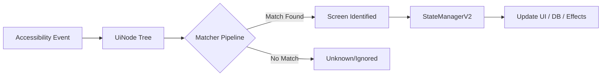

# DashBuddy

   

**DashBuddy** is an intelligent companion app for delivery drivers. It utilizes the Android
Accessibility Service API to analyze the driver's screen in real-time, automating logs, tracking
mileage, and providing safety-focused utility overlays.

> **PROJECT STATUS: EARLY BETA**
>
> This project is currently under active development. Features are being refactored for stability,
> and the detection pipeline is being trained on new screen variations. It is not yet ready for
> general public release.

---

## Key Features

* **Automated Shift Logging:** Automatically detects when a "Dash" starts and ends, logging
  duration and earnings.
* **Mileage Tracking:** Intelligent odometer reading updates based on app state (only tracks while
  active).
* **Dash Protection:** Detects when the delivery app pauses a Dash and immediately alerts the
  driver, preventing unnoticed service interruptions. A safety timer tracks the remaining pause
  window and transitions the app state automatically when it expires.
* **Offer Analysis:** (In Progress) Parses incoming delivery offers to calculate price-per-mile
  and hourly rates instantly.
* **Privacy-First:** All processing happens **on-device**. Sensitive banking and personal
  information screens are explicitly detected and ignored by the pipeline.

---

## Tech Stack

DashBuddy is built with modern Android engineering practices:

* **Language:** Kotlin 2.3+
* **UI:** Jetpack Compose (Overlays & Dashboard), Material 3
* **Dependency Injection:** Hilt (Dagger) with KSP
* **Asynchronicity:** Coroutines & Kotlin Flows
* **Persistence:** Room Database, DataStore Preferences
* **Network:** Retrofit + OkHttp (EPA fuel economy API, EIA gas price API)
* **Architecture:** Modular Clean Architecture with Unidirectional Data Flow (UDF) and a custom
  Recognition Pipeline.

---

## Module Structure

```
:app → :domain, :core:data, :core:database, :core:datastore, :core:location, :core:network
:core:data → :domain, :core:database, :core:datastore, :core:location, :core:network
:core:database → :domain
:core:network → :domain
:core:location → :domain
:core:datastore → :domain
```

* **`:domain`** — Pure Kotlin. Domain models, evaluation logic, repository interfaces. No Android
  dependencies.
* **`:core:database`** — Room entities, DAOs, and database setup.
* **`:core:data`** — Repository implementations and mappers. Bridges domain interfaces to the data
  layer.
* **`:core:network`** — Retrofit clients, OkHttp interceptors, and external API integrations.
* **`:core:location`** — Play Services GPS/fused location tracking.
* **`:core:datastore`** — Proto DataStore for app preferences.
* **`:app`** — Accessibility pipeline, screen matchers, state machine, side effects, UI, and Hilt
  DI wiring.

---

## Architecture: The Recognition Pipeline

DashBuddy solves the problem of "understanding" a third-party app without an API by using a custom
**Pipeline Architecture**:

1. **Ingestion:** The `AccessibilityService` captures UI events.
2. **Normalization:** The raw Android hierarchy is converted into a lightweight, immutable `UiNode`
   tree.
3. **Recognition:** The tree is passed through a chain of **Screen Matchers** (e.g.,
   `IdleMapMatcher`, `OfferMatcher`).
    * Matchers use a weighted priority system to resolve conflicts. `SensitiveScreenMatcher` runs
      first and blocks processing of banking/personal information screens.
4. **State Machine:** Identified screens are fed into `StateManagerV2`, a central reducer that
   manages the `AppStateV2` flow.
5. **Effects:** State transitions trigger side effect handlers: database writes, mileage tracking,
   notifications, floating overlays, and timeouts.


```mermaid
graph LR
    A[Accessibility Event] --> B[UiNode Tree]
    B --> C{Matcher Pipeline}
    C -- Match Found --> D[Screen Identified]
    C -- No Match --> E[Unknown/Ignored]
    D --> F[StateManagerV2]
    F --> G[Update UI / DB / Effects]
```

---

## Testing Infrastructure

DashBuddy relies on a robust **Snapshot Regression System** to ensure updates don't break screen
recognition.

* **Inbox Workflow:** Raw screen captures (JSON) are dropped into an "Inbox" folder.
* **Automated Triage:** A dedicated test processor scans the inbox, detects sensitive data (PII),
  and auto-sorts files into regression suites.
* **Pipeline Tests:** Parameterized tests verify that every known screen type is correctly
  identified by the current set of Matchers.

See **[Test Documentation](app/src/test/README.md)** for details on the testing workflow.

---

## Privacy & Safety

This app requires **Accessibility Permissions** to function. Privacy protection is enforced in
multiple layers:

* **OS-Level Filtering:** The Accessibility Service is configured with
  `android:packageNames="com.doordash.driverapp"` — the OS only delivers events from the Dasher
  app. Events from every other app on the device are never received.
* **Runtime Guard:** `AccessibilityListener` performs a redundant package name check as a second
  line of defense before any event enters the processing pipeline.
* **Sensitive Screen Detection:** Screens within the Dasher app where a driver enters personal or
  financial information (bank account setup, identity verification, etc.) are classified as
  `SENSITIVE` by `SensitiveScreenMatcher`, preventing them from being logged, snapshotted, or
  processed by the state machine. The current implementation uses keyword detection; explicit
  per-screen matchers are planned as a more robust long-term solution.
* **Snapshot System is a Dev Tool Only:** The UI snapshot system (used to build the regression
  test suite) is disabled entirely in release builds. It is only active in debug builds by
  explicit developer configuration.

---

## Building the Project

1. Clone the repository.
2. Open in **Android Studio** (recent stable release).
3. Sync Gradle.
4. Build the `app` module.
5. **Note:** To run on a device, you must manually enable "DashBuddy" under
   **Android Settings → Accessibility → Downloaded Apps**.

---

## Acknowledgements

Portions of this project were developed with assistance from AI tools:

* [Google Gemini](https://gemini.google.com/) (2.5 Pro+) — initial architecture exploration,
  refactoring guidance, and code generation
* [Claude](https://claude.ai/) (Sonnet, via Claude Code) — modular Clean Architecture refactor,
  domain layer design, and code generation

---

## License

[PolyForm Shield 1.0.0](LICENSE) — Copyright 2026 Stephen Trotter
