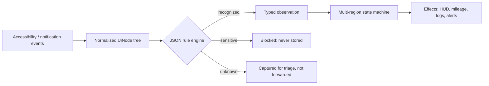

# DashBuddy

   

**DashBuddy gives delivery drivers the same view of their own work that the platform already
has.** It reads your delivery app's screen on-device, in real time, and turns it into the numbers
the app doesn't show you — your *true* net pay per offer (after fuel, time, and vehicle cost),
your real mileage, and a heads-up when a dash gets paused. Nothing leaves your phone.

> ### Status: alpha
> This is early, single-developer software. It works, but expect rough edges, screens it doesn't
> recognize yet, and changes between builds. **That's exactly where you come in** — see
> [How you can help](#how-you-can-help). You don't need to be a programmer.

---

## What it does for you

* **True net profitability.** Parses each incoming offer and shows real $/hour and $/mile *after*
  estimated fuel and vehicle cost — not the platform's headline number.
* **Automatic shift & mileage logging.** Detects when a dash starts, pauses, and ends, and tracks
  mileage only while you're actually working.
* **Dash-pause protection.** Notices when the delivery app quietly pauses your dash and alerts you
  before you lose the slot, with a countdown for the remaining window.
* **A glanceable bubble HUD.** A floating overlay you can read at a glance while driving — built so
  a stale number is treated as a bug, not a styling choice.
* **Your data stays yours.** All recognition and math happen on-device. The free tier never
  uploads anything. Banking, identity, and payment screens are detected and ignored, never logged.

Works with **DoorDash and Uber** today; Instacart and Walmart Spark are scaffolded and waiting on
recognition rules (a great [first contribution](#help-2-write-or-fix-recognition-rules)).

---

## Try it (no Android Studio needed)

**Requirements:** an Android phone running **Android 15 or newer**.

1. **Get the APK.** Download the latest `app-release.apk` from the
   [Releases page](https://github.com/sjtrotter/DashBuddy/releases).
   *(No release posted yet? See [Getting a build before the first release](#getting-a-build-before-the-first-release) below.)*
2. **Install it.** Open the downloaded file. Android will ask you to allow installing apps from
   your browser/Files app — accept, then install.
3. **Turn on the accessibility service.** This is how DashBuddy reads the delivery app's screen.
   Go to **Settings → Accessibility → Downloaded apps → DashBuddy** and enable it. Grant location
   when asked (used for mileage).
4. **Dash like normal.** DashBuddy runs in the background and surfaces the bubble HUD over your
   delivery app.

> **Why sideloading?** DashBuddy is source-available, not (yet) on the Play Store. Installing the
> signed APK directly is the intended path while the project is in alpha.

### Getting a build before the first release

Until tagged releases exist, every pull request and build also produces a **debug APK** through
continuous integration:

* Open the [Actions tab](https://github.com/sjtrotter/DashBuddy/actions), pick a recent
  successful run, and download the `debug-apk` artifact (requires a free GitHub login; artifacts
  expire after 7 days).
* This is also how you **test your own rule changes on-device** — open a pull request with your
  edited rules, and CI hands you back an installable APK with them baked in.

---

## How you can help

The single most valuable thing a real dasher can contribute is **what the app gets wrong in the
field** — which screens it misreads or doesn't recognize. None of the paths below require touching
the app's Kotlin code.

### Help #1: Report a bug or an unrecognized screen

If DashBuddy misreads a screen, ignores one it should handle, or shows a stale/wrong number while
you dash, that's a high-value report.

1. Open an [issue](https://github.com/sjtrotter/DashBuddy/issues/new) and describe **which
   platform, which screen, and what went wrong** (a phone screenshot helps a lot).
2. Add the **`on-dash-testing`** and **`bug`** labels if you can.

If you're comfortable pulling files off your phone: debug builds save the screens DashBuddy
*couldn't* recognize to the app's external files directory (sensitive screens are scrubbed and
never saved). Attaching one of those capture files turns "it didn't recognize the new pickup
screen" into something a rule can be written against immediately.

### Help #2: Write or fix recognition rules

**This is the heart of the project, and it's just JSON — no app code.** DashBuddy recognizes
screens with data-driven rules, not hand-written code. If you can read JSON, you can teach it to
recognize a new screen or fix one it gets wrong.

* The rule source lives in [`matchers/rules/`](matchers/rules/) as JSON5 — one file per platform
  (`doordash.json5`, `uber.json5`; new platforms get their own). The `matchers` build canonicalizes
  it to the streamlined JSON the app consumes (generated into `assets/rules/` at build time; #635 /
  ADR-0009), so there are no hand-maintained committed JSON assets.
* Each file points at [`docs/rules.schema.json`](docs/rules.schema.json) via its `$schema` field,
  so an editor like VS Code gives you autocomplete and live validation as you type.
* The rule format (predicates, field parsing, priorities) is documented in
  [ADR-0001](docs/adr/ADR-0001-matcher-rule-format.md).
* Recognition is tested against a corpus of real captured screens. Drop a capture into the
  snapshot inbox, run the recognition tests, and they tell you exactly what's recognized vs.
  still unknown — see the [testing guide](app/src/test/README.md).

Rules are deliberately decoupled from the app: the recognition layer is on its way to becoming a
separate, forkable, **Apache-2.0** repository delivered to running apps over a signed CDN
([#192](https://github.com/sjtrotter/DashBuddy/issues/192)). Contributing rules means contributing
to that open, driver-owned layer — not to a single app's codebase.

### Help #3: Field-test a change

When a change needs eyes on a real dash, it lands on the
[field-testing checklist](docs/field-testing/README.md) with a plain-language "watch for this, and
here's how to tell if it's working." Picking an item, dashing with it, and reporting back is
genuinely useful work.

---

## How it works (the short version)

DashBuddy's core challenge is understanding a third-party app with no API. The solution is a
pipeline that turns raw screen events into trustworthy state:


```mermaid
graph LR
    A[Accessibility / notification events] --> B[Normalized UiNode tree]
    B --> C{JSON rule engine}
    C -- recognized --> D[Typed observation]
    C -- sensitive --> X[Blocked: never stored]
    C -- unknown --> Y[Captured for triage, not forwarded]
    D --> E[Multi-region state machine]
    E --> F[Effects: HUD, mileage, logs, alerts]
```

1. **Sense.** Accessibility and notification listeners capture raw events and normalize them into
   an immutable `UiNode` tree.
2. **Recognize (data, not code).** Per-platform JSON rules — compiled once at load — match against
   the tree. There are no Kotlin matcher classes; changing recognition means editing rule JSON.
   Sensitive screens are blocked first; unrecognized screens are set aside for triage and never
   reach the state machine.
3. **Reduce.** Recognized observations feed a multi-region state machine (screen interpretation,
   per-platform session/task lifecycle, cross-platform aggregates). The reducers are pure and
   replayable, so the app can recover its exact state after a crash.
4. **Act.** State changes drive side effects at the edge — the bubble HUD, mileage tracking, event
   logging, pause alerts, and (consented, app-owned) offer actions.

The full architecture, module graph, and design principles are documented for contributors in
[CLAUDE.md](CLAUDE.md).

### Modules at a glance

```
:app → :domain, :core:{data, database, datastore, designsystem, location, network, pipeline, state}
:core:state    → :domain, :core:database, :core:pipeline
:core:pipeline → :domain
:core:data     → :domain, :core:{database, datastore, location, network}
```

* **`:domain`** — pure Kotlin models, evaluation logic, and pipeline/state contracts. No Android.
* **`:core:pipeline`** — the sensor pipelines and the JSON rule engine (recognition lives here).
* **`:core:state`** — the multi-region state machine and crash-recovery.
* **`:core:data` / `:core:database` / `:core:datastore`** — repositories, Room, and preferences.
* **`:core:network` / `:core:location`** — fuel/gas-price APIs and GPS mileage.
* **`:core:designsystem`** — the brand system and shared HUD components.
* **`:app`** — UI, overlays, side-effect handlers, and Hilt wiring.

---

## Privacy & safety

Privacy is a design input, not a feature bolted on. Protection is layered:

* **On-device by default.** Recognition and economics run entirely on your phone; the free tier
  uploads nothing. Network access is opt-in, per feature.
* **OS-level filtering.** The accessibility service only subscribes to the delivery-app packages —
  events from every other app on your device are never delivered, and a redundant package check
  runs before anything enters the pipeline.
* **Sensitive screens are blocked, never parsed or stored.** Banking, identity, and payment
  screens are caught at the recognition layer in both sensor pipelines and dropped before they can
  be logged or captured. The guard fails *closed* beyond rule coverage: a text-marker backstop
  scrubs even unrecognized sensitive screens, and frames are dropped entirely until rules finish
  loading at startup.
* **Captures are a developer tool only.** The screen-capture system that builds the recognition
  test corpus runs in debug builds; release builds bind a no-op, so nothing is written to disk.

---

## Building from source (for app developers)

If you do want to work on the app code:

1. Clone the repo and open it in **Android Studio** (recent stable).
2. Sync Gradle (JVM 21, min SDK 35, target SDK 36).
3. Build the `:app` module, or from the command line:
   ```bash
   ./gradlew :app:assembleDebug      # build the debug APK
   ./gradlew testDebugUnitTest       # run all unit tests
   ```
4. Enable **DashBuddy** under **Settings → Accessibility → Downloaded apps** to run on a device.

See [CLAUDE.md](CLAUDE.md) for architecture, conventions, and the full build/test commands.

---

## Acknowledgements

Portions of this project were developed with assistance from AI coding tools, including
[Claude](https://claude.ai/) (via Claude Code) and [Google Gemini](https://gemini.google.com/) —
architecture, refactoring, and the data-driven recognition engine.

---

## License

The application is licensed under [PolyForm Shield 1.0.0](LICENSE) — Copyright 2026 Stephen
Trotter. The recognition rules are intended to ship under Apache-2.0 as a separate, forkable layer
(see [#192](https://github.com/sjtrotter/DashBuddy/issues/192)).
