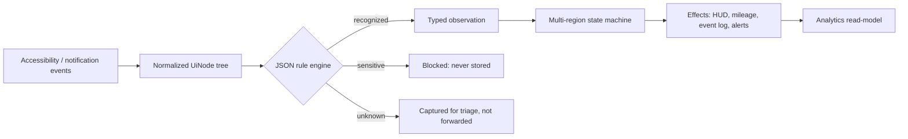

# DashBuddy

   

**DashBuddy gives delivery drivers the same view of their own work that the platform already
has.** It reads your delivery app's screen on-device, in real time, and turns it into the numbers
the app doesn't show you — your *true* net pay per offer (after fuel, time, and vehicle cost),
your real mileage, what your past dashes actually earned per hour, and a heads-up when a dash gets
paused. Nothing leaves your phone unless you turn a specific upload on.

> ### Status: alpha
> This is early, single-developer software. It works, but expect rough edges, screens it doesn't
> recognize yet, and changes between builds. **That's exactly where you come in** — see
> [How you can help](#how-you-can-help). You don't need to be a programmer.

---

## What it does for you

* **True net profitability.** Parses each incoming offer and shows real `$`/hour and `$`/mile *after*
  estimated fuel and vehicle cost — not the platform's headline number. An offer it cannot measure
  (no distance) is shown as unmeasured, never scored with a guess.
* **Automatic shift & mileage logging.** Detects when a dash starts, pauses, and ends, and tracks
  mileage only while you're actually working. Every GPS fix is sanity-checked before it counts.
* **An analytics hub built from your own history.** Three destinations: **Today** (what to do
  now), the **hub** (Money · Offers · Time — where the money went, estimate vs. reality per offer,
  working vs. idle time), and the **Playbook** (a weekly plan ranked from your own best hours,
  graded against what you actually did). Every record freezes its economics at the time it
  happened, so a later change to your cost settings never rewrites history. Corrections are
  append-only and the whole read-model can be rebuilt from the event log.
* **Dash-pause protection.** Notices when the delivery app quietly pauses your dash and alerts you
  before you lose the slot, with a countdown for the remaining window.
* **A glanceable bubble HUD.** A floating overlay you can read at a glance while driving — built so
  a stale number is treated as a bug, not a styling choice. Offers can also be spoken aloud.
* **Consented, per-action automation.** DashBuddy can tap Accept / Decline / expand-earnings for
  you, but only after you allow **each** automation individually; nothing is ever granted by
  default, and a denial sticks across updates.
* **Your data stays yours.** All recognition and math happen on-device. Release builds upload
  nothing. Your own banking, identity, and payment screens are detected and ignored, never logged.
  You can export your delivery history as CSV from Settings → Data & Privacy → Export Data.

**DoorDash** is the primary, field-tested platform. **Uber Driver** has a ruleset and offer-overlay
capture but far less field coverage. Instacart and Walmart Spark are registered and waiting on
recognition rules (a great [first contribution](#help-2-write-or-fix-recognition-rules)).

---

## Try it (no Android Studio needed)

**Requirements:** an Android phone running **Android 11 or newer**.

1. **Get the APK.** Download the latest `app-release.apk` from the
   [Releases page](https://github.com/sjtrotter/DashBuddy/releases).
   *(No release posted yet? See [Getting a build before the first release](#getting-a-build-before-the-first-release) below.)*
2. **Install it.** Open the downloaded file. Android will ask you to allow installing apps from
   your browser/Files app — accept, then install.
3. **Walk the front door.** On first launch DashBuddy asks, in order: whether it may receive
   screen events beyond the delivery apps themselves (needed to see overlay offers; declining
   keeps it filtered to the delivery apps), then the **accessibility service** — this is how it
   reads the delivery app's screen; enable it under **Settings → Accessibility → Downloaded apps →
   DashBuddy** when prompted — then location (used for mileage), notifications, and finally one
   Allow / Don't allow row per automation it could perform for you.
4. **Dash like normal.** DashBuddy runs in the background and surfaces the bubble HUD over your
   delivery app.

> **Why sideloading?** DashBuddy is source-available, not (yet) on the Play Store. Installing the
> signed APK directly is the intended path while the project is in alpha.

### Getting a build before the first release

No release tag has been published yet. Every pull request produces a **debug APK** through
continuous integration:

* Open the [Actions tab](https://github.com/sjtrotter/DashBuddy/actions), pick a recent
  successful *PR Check* run, and download the `debug-apk-<PR number>` artifact (requires a free
  GitHub login; artifacts expire after 7 days).
* This is also how you **test your own rule changes on-device** — open a pull request with your
  edited rules, and CI hands you back an installable APK with them baked in.

Debug builds carry developer tooling that release builds compile out: screen captures of
unrecognized screens, and the opt-in census uploader described under
[Privacy & safety](#privacy--safety).

---

## How you can help

The single most valuable thing a real dasher can contribute is **what the app gets wrong in the
field** — which screens it misreads or doesn't recognize. None of the paths below require touching
the app's Kotlin code.

### Help #1: Report a bug or an unrecognized screen

If DashBuddy misreads a screen, ignores one it should handle, or shows a stale/wrong number while
you dash, that's a high-value report.

1. Open an [issue](https://github.com/sjtrotter/DashBuddy/issues/new) and describe **which
   platform, which screen, and what went wrong** (a phone screenshot helps a lot).
2. Add the **`on-dash-testing`** and **`bug`** labels if you can.

If you're comfortable pulling files off your phone: debug builds save the screens DashBuddy
*couldn't* recognize to the app's external files directory (your own sensitive screens are dropped
before capture, and customer names and addresses are hashed, never stored in clear). Attaching one
of those capture files turns "it didn't recognize the new pickup screen" into something a rule can
be written against immediately.

### Help #2: Write or fix recognition rules

**This is the heart of the project, and it's just JSON — no app code.** DashBuddy recognizes
screens with data-driven rules, not hand-written code. If you can read JSON, you can teach it to
recognize a new screen or fix one it gets wrong.

* The rule source lives in [`matchers/rules/`](matchers/rules/) as JSON5. A platform is either one
  flat file ([`uber.json5`](matchers/rules/uber.json5)) or a directory of human-readable per-surface
  files ([`doordash/`](matchers/rules/doordash/) — `offer`, `pickup`, `dropoff`, `dash-lifecycle`,
  `sensitive`, `notifications`, … with a `_manifest.json5`; see its
  [README](matchers/rules/doordash/README.md)). The `matchers` build merges and canonicalizes the
  source into the JSON the app consumes, generated at build time — there are no hand-maintained
  committed rule assets.
* Each file points at a schema via `$schema` ([`docs/rules.schema.json`](docs/rules.schema.json)
  for a flat file, [`docs/rules.fragment.schema.json`](docs/rules.fragment.schema.json) for a
  surface sub-file), so an editor like VS Code gives you autocomplete and live validation.
* The rule format (predicates, field parsing, priorities, redaction) is documented in
  [ADR-0001](docs/adr/ADR-0001-matcher-rule-format.md); the source layout and distribution model
  in [ADR-0009](docs/adr/ADR-0009-rule-distribution-channels.md). Rule regexes run on a
  linear-time engine (RE2 syntax: no lookaround or backreferences) with measured size caps, so a
  bad pattern can slow nothing down.
* Rules match on the platform's own chrome (labels, view ids, layout), never on a particular
  store's name — merchant names are parsed *data*.
* Recognition is tested against a corpus of real captured screens. Drop a capture into the
  snapshot inbox, run the recognition tests, and they tell you exactly what's recognized vs.
  still unknown — see the [testing guide](app/src/test/README.md).

Rules are deliberately decoupled from the app: the ruleset is **Apache-2.0** and built as a
separate included build so it can become its own forkable repository, delivered to running apps
over signed JSON ([#192](https://github.com/sjtrotter/DashBuddy/issues/192)). Contributing rules
means contributing to that open, driver-owned layer — not to a single app's codebase.

### Help #3: Field-test a change

When a change needs eyes on a real dash, it lands on the
[field-testing checklist](docs/field-testing/README.md) with a plain-language "watch for this, and
here's how to tell if it's working." Picking an item, dashing with it, and reporting back is
genuinely useful work.

---

## How it works (the short version)

DashBuddy's core challenge is understanding a third-party app with no API. The solution is a
pipeline that turns raw screen events into trustworthy state:


```mermaid
graph LR
    A[Accessibility / notification events] --> B[Normalized UiNode tree]
    B --> C{JSON rule engine}
    C -- recognized --> D[Typed observation]
    C -- sensitive --> X[Blocked: never stored]
    C -- unknown --> Y[Captured for triage, not forwarded]
    D --> E[Multi-region state machine]
    E --> F[Effects: HUD, mileage, event log, alerts]
    F --> G[Analytics read-model]
```

1. **Sense.** Accessibility and notification listeners capture raw events and normalize them into
   an immutable `UiNode` tree.
2. **Recognize (data, not code).** Per-platform JSON rules — compiled once at load — match against
   the tree. There are no Kotlin matcher classes; changing recognition means editing rule JSON.
   Sensitive screens are blocked first; unrecognized screens are set aside for triage and never
   reach the state machine.
3. **Reduce.** Recognized observations feed a multi-region state machine (screen interpretation,
   per-platform session/task lifecycle, cross-platform aggregates). The reducers are pure and
   replayable, so the app can recover its exact state after a crash.
4. **Act.** State changes drive side effects at the edge — the bubble HUD, mileage tracking, event
   logging, pause alerts, and (consented, app-owned) offer actions.
5. **Remember.** The event log is the source of truth; the analytics tables are a projection of it
   that can be wiped and rebuilt at any time, with each record's economics frozen as of the day
   it happened.

The full architecture, module graph, and design principles are documented for contributors in
[CLAUDE.md](CLAUDE.md) and, at receipt level, in [`docs/architecture/`](docs/architecture/).

### Modules at a glance

```
:app → :domain, :core:{data, database, datastore, designsystem, location, network, pipeline, state},
       :feature:{settings, setup, dashboard, bubble}
:feature:*     → :domain (+ :core:data / :core:designsystem as each one needs)
:core:state    → :domain, :core:database, :core:pipeline
:core:pipeline → :domain
:core:data     → :domain, :core:{database, datastore, location, network}

matchers/        included build — the Apache-2.0 ruleset source + canonicalizer
census-contract/ included build — the Apache-2.0 wire contract shared with the census server
```

* **`:domain`** — pure Kotlin models, evaluation logic, pipeline/state contracts, and the
  number/time formatting policy. No Android.
* **`:core:pipeline`** — the sensor pipelines and the JSON rule engine (recognition lives here).
* **`:core:state`** — the multi-region state machine and crash-recovery.
* **`:core:data` / `:core:database` / `:core:datastore`** — repositories, the analytics
  projector, Room, and preferences.
* **`:core:network` / `:core:location`** — the gas-price API, the census transport, and GPS mileage.
* **`:core:designsystem`** — the brand system and shared components.
* **`:feature:*`** — per-feature UI (settings, setup wizard, dashboard, bubble HUD content),
  depending only downward.
* **`:app`** — the shell, overlays, side-effect handlers, workers, and Hilt wiring.

---

## Privacy & safety

Privacy is a design input, not a feature bolted on. Protection is layered:

* **On-device by default.** Recognition and economics run entirely on your phone; release builds
  upload nothing. Network access is opt-in, per feature (the only network feature in a release
  build today is the optional regional gas-price lookup).
* **You decide what the service may see.** By default the accessibility service is filtered to the
  delivery-app packages. Receiving events more widely (needed to catch overlay offers) is a
  separate, explicit consent asked before the service is even enabled; declining is durable.
* **Your own sensitive screens are blocked, never parsed or stored.** Banking, identity, payment,
  and document-camera screens are caught at the recognition layer in both sensor pipelines and
  dropped before they can be logged or captured. The guard fails *closed* beyond rule coverage: a
  text-marker backstop drops even unrecognized sensitive screens, and frames are dropped entirely
  until rules finish loading at startup.
* **Customers are hashed, not blocked.** Delivery screens are recognized, but a customer's name
  and address are hashed on-device before anything is stored, so the app can tell deliveries
  apart without ever keeping who or where. Recognized screens also carry per-rule redaction, and
  a rules-independent scrub runs over everything else.
* **Automations need your explicit permission, one by one.** Taps are app-owned, aimed by the
  ruleset, verified at fire time, and fire only for an automation you allowed.
* **Captures and the census are developer tools.** Debug builds save unrecognized screens to the
  app's files for building the recognition test corpus; release builds bind a no-op and write
  nothing. Debug builds also carry an **opt-in UNKNOWN-screen census**: hash-only screen
  *skeletons* (structure plus hashed labels, never text) can be uploaded to a self-hosted,
  AGPL-3.0 server so unfamiliar screens can be counted across installs; labels are revealed only
  once enough distinct installs have seen them. The privacy model is
  [ADR-0011](docs/adr/ADR-0011-unknown-census-privacy-model.md); release builds contain no
  uploader at all.
* **Logs are two products.** The on-device debug log is for the developer; the exportable bug
  report (Settings → Data & Privacy → Export Data) carries only INFO-and-above lines and passes a
  fail-closed scrub for sensitive markers before it is written.

See [LEGAL.md](LEGAL.md) for the good-faith reading of the platform terms that governs scope:
DashBuddy performs **empirical measurement of the visible offer surface**, never reverse
engineering of the platform.

---

## Building from source (for app developers)

If you do want to work on the app code:

1. Clone the repo and open it in **Android Studio** (recent stable).
2. Sync Gradle (JVM 21, Kotlin 2.3, min SDK 30, target SDK 36).
3. Build the `:app` module, or from the command line:
   ```bash
   ./gradlew :app:assembleDebug                                   # build the debug APK
   ./gradlew testDebugUnitTest :domain:test censusContractTest    # run all unit tests
   ./gradlew :app:testDebugUnitTest --tests "*AllMatchersSuite*"  # recognition regressions only
   ```
4. Enable **DashBuddy** under **Settings → Accessibility → Downloaded apps** to run on a device.

See [CLAUDE.md](CLAUDE.md) for architecture, conventions, and the full build/test commands.

---

## Acknowledgements

Portions of this project were developed with assistance from AI coding tools, including
[Claude](https://claude.ai/) (via Claude Code), OpenAI Codex, and
[Google Gemini](https://gemini.google.com/) — architecture, refactoring, review, and the
data-driven recognition engine.

---

## License

The application is licensed under [PolyForm Shield 1.0.0](LICENSE) — Copyright 2026 Stephen
Trotter. Two parts are **separately licensed under Apache-2.0** so they can live outside the app
unencumbered: the recognition ruleset in [`matchers/`](matchers/) ([licence](matchers/LICENSE)) —
a forkable recognition layer (Pillar 2; see
[#192](https://github.com/sjtrotter/DashBuddy/issues/192)) — and the census wire contract in
[`census-contract/`](census-contract/) ([licence](census-contract/LICENSE)), shared with the
separate AGPL-3.0 [census server](https://github.com/sjtrotter/dashbuddy-census). The ruleset is
empirical measurement of the visible offer surface, published as data.
